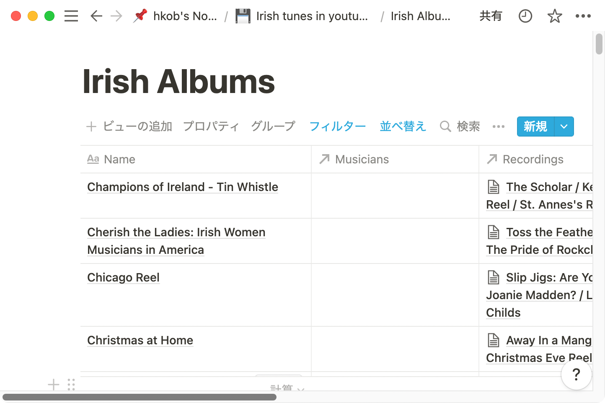

# NotionRubyMapping

Notion Ruby mapping is currently under development.

Development note is here. → [Idea note of "notion_ruby_mapping"](https://www.notion.so/hkob/Idea-note-of-notion_ruby_mapping-3b0a3bb3c171438a830f9579d41df501)

## Table of Contents
- [NotionRubyMapping](#notionrubymapping)
  - [Table of Contents](#table-of-contents)
  - [1. Installation](#1-installation)
  - [2. Example code](#2-example-code)
  - [3. Usage](#3-usage)
    - [3.1 Create a New Integration](#31-create-a-new-integration)
    - [3.2 Create client](#32-create-client)
    - [3.3 Retrieve a database](#33-retrieve-a-database)
    - [3.4 Retrieve a page](#34-retrieve-a-page)
    - [3.5 Query a database](#35-query-a-database)
      - [3.5.1 A simple example](#351-a-simple-example)
      - [3.5.2 Property classes](#352-property-classes)
      - [3.5.3 Query object generator of property objects](#353-query-object-generator-of-property-objects)
      - [3.5.4 Complex conditions](#354-complex-conditions)
      - [3.5.5 Sort criteria](#355-sort-criteria)
    - [3.6 Access the database or page values and properties](#36-access-the-database-or-page-values-and-properties)
  - [3.7 Set icon (Database / Page)](#37-set-icon-database--page)
  - [3.8 Update page property values](#38-update-page-property-values)
    - [3.8.1 Assign property and update it (fastest: one API call only)](#381-assign-property-and-update-it-fastest-one-api-call-only)
    - [3.8.2 Update the loaded page (easy but slow: two API calls)](#382-update-the-loaded-page-easy-but-slow-two-api-calls)
    - [3.8.3 Update the unloaded page with auto-load (easy but slow: two API calls)](#383-update-the-unloaded-page-with-auto-load-easy-but-slow-two-api-calls)
    - [3.8.4 Explanation of how to update each property](#384-explanation-of-how-to-update-each-property)
      - [3.8.4.1 NumberProperty](#3841-numberproperty)
      - [3.8.4.2 SelectProperty](#3842-selectproperty)
      - [3.8.4.3 MultiSelectProperty](#3843-multiselectproperty)
      - [3.8.4.4 DateProperty](#3844-dateproperty)
    - [3.9 Iteration of list object](#39-iteration-of-list-object)
  - [4. ChangeLog](#4-changelog)
  - [5. Contributing](#5-contributing)
  - [6. License](#6-license)
  - [7. Code of Conduct](#7-code-of-conduct)
  - [8. Acknowledgements](#8-acknowledgements)

<!-- @import "[TOC]" {cmd="toc" depthFrom=2 depthTo=4 orderedList=false} -->

## 1. Installation

Add this line to your application's Gemfile:

```ruby
gem 'notion_ruby_mapping'
```

And then execute:

    $ bundle install

Or install it yourself as:

    $ gem install notion_ruby_mapping

## 2. Example code

The following code sets a "💿" icon on all unset pages in the database.
```Ruby
require "notion_ruby_mapping"

include NotionRubyMapping

token = ENV["NOTION_API_TOKEN"]
database_id = ENV["DATABASE_ID"]

NotionCache.instance.create_client token

Database.query(database_id).each do |page|
  p page.set_icon(emoji: "💿").id unless page.icon
end
```

|Before execution|After execution|
|---|---|
|||

The following code sets serial numbers to the pages whose title is not empty in ascending order of titles.
```Ruby
tp = RichTextProperty.new("TextTitle")
Database.query(database_id, tp.filter_is_not_empty.ascending(tp)).each.with_index(1) do |page, index|
  page.properties["NumberTitle"].number = index
  page.update
end
```
| After execution                               |
|-----------------------------------------------|
|  |

## 3. Usage

### 3.1 Create a New Integration

Please check [Notion documentation](https://developers.notion.com/docs#getting-started).

### 3.2 Create client

Please create a client (notion-ruby-client) before you use the following class.
```Ruby
NotionCache.instance.create_client ENV["NOTION_API_TOKEN"]
```

### 3.3 Retrieve a database

Database.find(id) creates a Database object from the results of Notion API.

```Ruby
db = Database.find("c37a2c66-e3aa-4a0d-a447-73de3b80c253")
```

Database.new(id) creates a Database object without accessing to Notion.
If you want to retrieve the contents after creation, please use a `reload` method.

```Ruby
db = Database.new("c37a2c66-e3aa-4a0d-a447-73de3b80c253")
db.reload
```

### 3.4 Retrieve a page

Page.find(id) creates a Page object from the results of Notion API.

```Ruby
page = Page.find("c01166c6-13ae-45cb-b968-18b4ef2f5a77")
```

Page.new(id) creates a Page object without accessing to Notion.
If you want to retrieve the contents after creation, please use a `reload` method.

```Ruby
page = Page.new("c01166c6-13ae-45cb-b968-18b4ef2f5a77")
page.reload
```

### 3.5 Query a database

#### 3.5.1 A simple example

Gets a List object of Page objects contained in the database.
You can obtain filtered and ordered pages using Query object.
```Ruby
Database.query("c37a2c66-e3aa-4a0d-a447-73de3b80c253") # retrieves all pages
Database.query("c37a2c66-e3aa-4a0d-a447-73de3b80c253", query) # retrieves using query
```

Query object can be generated from the following Property objects.
For example, in order to obtain the pages whose title starts with "A" and ordered by ascending,
the following code can be used.
```Ruby
tp = TitleProperty.new "Title"
query = tp.filter_starts_with("A").ascending(tp)
pages = Database.query database_id, query
```

#### 3.5.2 Property classes

There are the following 17 XXXProperty classes corresponding to Notion databases.
They are child classes of a `Property` class
and these constructor method has a common form where the first argument is the property name.
```Ruby
xp = XXXProperty.new "property name"
```

1. TitleProperty
2. RichTextProperty
3. UrlProperty
4. EmailProperty
5. PhoneNumberProperty
6. NumberProperty
7. CheckboxProperty
8. SelectProperty
9. MultiSelectProperty
10. PeopleProperty
11. CreatedByProperty
12. LastEditedByProperty
13. DateProperty
14. CreatedTimeProperty
15. LastEditedTimeProperty
16. FilesProperty
17. FormulaProperty

#### 3.5.3 Query object generator of property objects

The following methods for the Property objects generate a query object.
- TitleProperty, RichTextProperty, UrlProperty, EmailProperty, PhoneNumberProperty
  - filter_equals(value)
  - filter_does_not_equal(value)
  - filter_contains(value)
  - filter_does_not_contain(value)
  - filter_starts_with(value)
  - filter_ends_with(value)
  - filter_is_empty
  - filter_is_not_empty
- NumberProperty
  - filter_equals(value)
  - filter_does_not_equal(value)
  - filter_greater_than(value)
  - filter_less_than(value)
  - filter_greater_than_or_equal_to(value)
  - filter_less_than_or_equal_to(value)
  - filter_is_empty
  - filter_is_not_empty
- CheckboxProperty
  - filter_equals(value)
  - filter_does_not_equal(value)
- SelectProperty
  - filter_equals(value)
  - filter_does_not_equal(value)
  - filter_is_empty
  - filter_is_not_empty
- MultiSelectProperty, PeopleProperty, CreatedByProperty, LastEditedByProperty
  - filter_contains(value)
  - filter_does_not_contain(value)
  - filter_is_empty
  - filter_is_not_empty
- DateProperty, CreatedTimeProperty, LastEditedTimeProperty
  - filter_equals(value(Date / Time / DateTime / String))
  - filter_does_not_equal(value(Date / Time / DateTime / String))
  - filter_before(value(Date / Time / DateTime / String))
  - filter_after(value(Date / Time / DateTime / String))
  - filter_on_or_before(value(Date / Time / DateTime / String))
  - filter_on_or_after(value(Date / Time / DateTime / String))
  - filter_past_week
  - filter_past_month
  - filter_past_year
  - filter_next_week
  - filter_next_month
  - filter_next_year
- FilesProperty
  - filter_is_empty
  - filter_is_not_empty
- FormulaProperty
  - filter_equals(value(Date / Time / DateTime / String))
  - filter_does_not_equal(value(Date / Time / DateTime / String))
  - filter_before(value(Date / Time / DateTime / String))
  - filter_after(value(Date / Time / DateTime / String))
  - filter_on_or_before(value(Date / Time / DateTime / String))
  - filter_on_or_after(value(Date / Time / DateTime / String))
  - filter_past_week
  - filter_past_month
  - filter_past_year
  - filter_next_week
  - filter_next_month
  - filter_next_year
  - filter_contains(value)
  - filter_does_not_contain(value)
  - filter_starts_with(value)
  - filter_ends_with(value)
  - filter_greater_than(value)
  - filter_less_than(value)
  - filter_greater_than_or_equal_to(value)
  - filter_less_than_or_equal_to(value)
  - filter_is_empty
  - filter_is_not_empty

#### 3.5.4 Complex conditions
Complex filters can be generated `and` / `or` methods.
Here are some sample scripts and the json parameters created from them.

```Ruby
# Prepare some sample properties
tp = TitleProperty.new "tp"
np = NumberProperty.new "np"
cp = CheckboxProperty.new "cp"
letp = LastEditedTimeProperty.new "letp"
```

- query1: (A and B) filter
```Ruby
query1 = tp.filter_starts_with("start")
           .and(np.filter_greater_than(100))

# Result of query1.filter
{
  "and" => [
    {
      "property" => "tp",
      "title" => {"starts_with" => "start"},
    },
    {
      "property" => "np",
      "number" => {"greater_than" => 100},
    },
  ],
}
```

- query2: (A and B and C) filter
```Ruby
query2 = tp.filter_starts_with("start")
  .and(np.filter_greater_than(100))
  .and(cp.filter_equals(true))

# Result of query2.filter
{
  "and" => [
    {
      "property" => "tp",
      "title" => {"starts_with" => "start"},
    },
    {
      "property" => "np",
      "number" => {"greater_than" => 100},
    },
    {
      "property" => "cp",
      "checkbox" => {"equals" => true},
    },
  ],
}
```

- query3: (A or B) filter
```Ruby
query3 = tp.filter_starts_with("start")
  .or(np.filter_greater_than(100))

# Result of query3.filter
{
  "or" => [
    {
      "property" => "tp",
      "title" => {"starts_with" => "start"},
    },
    {
      "property" => "np",
      "number" => {"greater_than" => 100},
    },
  ],
}
```

- query4: (A or B or C) filter
```Ruby
query4 = tp.filter_starts_with("start")
      .or(np.filter_greater_than(100))
      .or(cp.filter_equals(true))

# Result of query4.filter
{
  "or" => [
    {
      "property" => "tp",
      "title" => {"starts_with" => "start"},
    },
    {
      "property" => "np",
      "number" => {"greater_than" => 100},
    },
    {
      "property" => "cp",
      "checkbox" => {"equals" => true},
    },
  ],
}
```

- query5: ((A and B) or C) filter
```Ruby
query5 = tp.filter_starts_with("start")
  .and(np.filter_greater_than(100))
  .or(cp.filter_equals(true))

# Result of query5.filter
{
  "or" => [
    {
      "and" => [
        {
          "property" => "tp",
          "title" => {"starts_with" => "start"},
        },
        {
          "property" => "np",
          "number" => {"greater_than" => 100},
        },
      ],
    },
    {
      "property" => "cp",
      "checkbox" => {"equals" => true},
    },
  ],
}
```

- query6: ((A or B) and C) filter
```Ruby
query6 = tp.filter_starts_with("start")
  .or(np.filter_greater_than(100))
  .and(cp.filter_equals(true))

# Result of query6.filter
{
  "and" => [
    {
      "or" => [
        {
          "property" => "tp",
          "title" => {"starts_with" => "start"},
        },
        {
          "property" => "np",
          "number" => {"greater_than" => 100},
        },
      ],
    },
    {
      "property" => "cp",
      "checkbox" => {"equals" => true},
    },
  ],
}
```

- query7: ((A and B) or (C and D)) filter
```Ruby
query7 = np.filter_greater_than(100).and(np.filter_less_than(200))
      .or(np.filter_greater_than(300).and(np.filter_less_than(400)))

# Result of query7.filter
{
  "or" => [
    {
      "and" => [
        {
          "property" => "np",
          "number" => {"greater_than" => 100},
        },
        {
          "property" => "np",
          "number" => {"less_than" => 200},
        },
      ],
    },
    {
      "and" => [
        {
          "property" => "np",
          "number" => {"greater_than" => 300},
        },
        {
          "property" => "np",
          "number" => {"less_than" => 400},
        },
      ],
    },
  ],
}
```

#### 3.5.5 Sort criteria
Sort criteria can be appended to an existing query object.
If you don't use the previous filters, you can generate by `Query.new`.

- sort criteria only
```Ruby
query8 = Query.new.ascending tp
query9 = Query.new.ascending letp
query10 = Query.new.descending tp
query11 = Query.new.descending letp
query12 = Query.new.ascending(tp).descending letp

# Result of query8.sort
[{"property" => "tp", "direction" => "ascending"}]

# Result of query9.sort
[{"timestamp" => "letp", "direction" => "ascending"}]

# Result of query10.sort
[{"property" => "tp", "direction" => "descending"}]

# Result of query11.sort
[{"timestamp" => "letp", "direction" => "descending"}]

# Result of query12.sort
[
  {"property" => "tp", "direction" => "ascending"},
  {"timestamp" => "letp", "direction" => "descending"},
]
```

- filter with sort
```Ruby
query13 = tp.filter_starts_with("A").ascending(tp)

# Result of query13.filter
{"property" => "tp", "title" => {"starts_with" => "start"}}

# Result of query13.sort
[{"property" => "tp", "direction" => "ascending"}]
```

### 3.6 Access the database or page values and properties

Database or Page values can be accessed by [] access with keywords.

```Ruby
obj["icon"]
```

Almost values returns a hash or an array object except "properties".
`obj["properties"]` or `obj.properties` returns a PropertyCache object.
The PropertyCache object is created from json information on the first access and is cached to the Page or Database object.
If page or database object is generated by `.new` method, the object don't have json information.
In this case, the `.properties` method calls `reload` method automatically, then it creates the PropertyCache object from the loaded json information (called auto-load function).

```Ruby
obj["properties"]
# or
obj.properties
```

Each Property object is obtained by [] access with the property name.
The Property object is also created on the first access and is cached to the PropertyCache object.

```Ruby
np = obj.properties["NumberTitle"]
```

## 3.7 Set icon (Database / Page)

Database or Page icon can update by `obj.set_icon` method.
You can set icon as emoji or external url.

```Ruby
obj.set_icon emoji: "💿" # set emoji
obj.set_icon url: "https://cdn.profile-image.st-hatena.com/users/hkob/profile.png" # set external url
```

## 3.8 Update page property values

Page properties can update in the following three ways.

### 3.8.1 Assign property and update it (fastest: one API call only)

This is the fastest way using an empty Page object.
`page.assign_property` generates an empty PropertyCache and an empty XXXProperty.
After updating the property value, please call `page.update`.
Notion API will be called using a JSON payload generated from the PropertyCache object.

```Ruby
page = Page.new id: page_id
property = page.assign_property NumberProperty, "NumberTitle"
property.number = 2022
page.update # update page API call
print page
```

### 3.8.2 Update the loaded page (easy but slow: two API calls)

This is an easiest way using a loaded Page object.
A PropertyCache object is automatically generated by `page.properties`.
After updating the property value, please call `page.update`.
Notion API will be called using a JSON payload generated from the PropertyCache object.
There are two API calls (find and update).

```Ruby
page = Page.find first_page_id # retrieve page API call
property = page.properties["NumberTitle"]
property.number = 2022
page.update # update page API call
print page
```

### 3.8.3 Update the unloaded page with auto-load (easy but slow: two API calls)

This is also an easiest way using an auto-load function of the Page object.
A PropertyCache object is automatically generated by `page.properties` using the auto-load function of page objects.
After updating the property value, please call `page.update`.
Notion API will be called using a JSON payload generated from the PropertyCache object.
There are also two API calls (find and update).

```Ruby
page = Page.new id: first_page_id
property = page.properties["NumberTitle"] # retrieve page API call (auto-load)
property.number = 12345
page.update # update page API call
print page
```

### 3.8.4 Explanation of how to update each property

#### 3.8.4.1 NumberProperty

NumberProperty can set a number by `.number=`.

```Ruby
np = page.properties["NumberTitle"]
np.number = 456
p np.create_json
# Result => {"number" => 456}
```

#### 3.8.4.2 SelectProperty

NumberProperty can set a select name by `.select=`.

```Ruby
sp = page.properties["SelectTitle"]
sp.select = "Select 2"
p sp.create_json
# Result => {"select" => {"name" => "Select 2"}}
```

#### 3.8.4.3 MultiSelectProperty

MultiSelectProperty can set a select value or Array of select values by `.multi_select=`.

```Ruby
msp = page.properties["MultiSelectTitle"]
msp.select = "MS2"
p msp.create_json
# Result => {"multi_select" => [{"name" => "MS2"}]}

msp.multi_select = %w[MS2 MS1]
p msp.create_json
# Result => {"multi_select" => [{"name" => "MS2"}, {"name" => "MS1"}]}
```

#### 3.8.4.4 DateProperty

DateProperty can set a start_date or end_date by `.start_date=` or `end_date=`.
Date, Time, DateTime or String object can be used to the argument.

```Ruby
dp = page.properties["DateTitle"]
dp.start_date = Date.new(2022, 2, 22)
p dp.create_json
# Result => {"start" => "2022-02-22"}

dp.start_date = Time.new(2022, 2, 22, 1, 23, 45, "+09:00")
p dp.create_json
# Result => {"start" => "2022-02-22T01:23:45+09:00"}

dp.start_date = DateTime.new(2022, 2, 23, 1, 23, 45, "+09:00")
p dp.create_json
# Result => {"start" => "2022-02-23T01:23:45+09:00"}

dp.start_date = Date.new(2022, 2, 20)
dp.end_date = Date.new(2022, 2, 22)
p dp.create_json
# Result => {"start" => "2022-02-20", "end" => "2022-02-22"}

dp.start_date = Time.new(2022, 2, 21, 1, 23, 45, "+09:00")
dp.end_date = Time.new(2022, 2, 22, 1, 23, 45, "+09:00")
p dp.create_json
# Result => {"start" => "2022-02-21T01:23:45+09:00", "end" => "2022-02-22T01:23:45+09:00"}

dp.start_date = DateTime.new(2022, 2, 21, 1, 23, 45, "+09:00")
dp.end_date = DateTime.new(2022, 2, 22, 1, 23, 45, "+09:00")
p dp.create_json
# result => {"start" => "2022-02-21T01:23:45+09:00", "end" => "2022-02-22T01:23:45+09:00"}
```

### 3.9 Iteration of list object

Some methods like as `Database.query` return a list object.
Since the list object also has a json array object, `Enumerable` module is implemented.
Each iteration creates a Page or Block object and calls the block with it as an argument.

```Ruby
pages = Database.query("c37a2c66-e3aa-4a0d-a447-73de3b80c253") # retrieves all pages
pages.each do |page| # obj's class is Page or Block
  page.set_icon(emoji: "💿") unless page["icon"]
end
```

## 4. ChangeLog

- 2022/2/25 add_property_for_update -> assign_property, update README.md
- 2022/2/20 add support for MultiSelectProperty
- 2022/2/19 add support for SelectProperty
- 2022/2/17 added Page#properties, Page#add_property_for_update, Page#update
- 2022/2/17 added Page#properties, Page#add_property_for_update, Page#update
- 2022/2/16 added PropertyCache and Payload class
- 2022/2/14 added Database#set_icon
- 2022/2/13 added Page#set_icon
- 2022/2/13 First commit

## 5. Contributing

Bug reports and pull requests are welcome on GitHub at https://github.com/hkob/notion_ruby_mapping. This project is intended to be a safe, welcoming space for collaboration, and contributors are expected to adhere to the [code of conduct](https://github.com/[USERNAME]/notion_ruby_mapping/blob/main/CODE_OF_CONDUCT.md).

## 6. License

The gem is available as open source under the terms of the [MIT License](https://opensource.org/licenses/MIT).

## 7. Code of Conduct

Everyone interacting in the NotionRubyMapping project's codebases, issue trackers, chat rooms and mailing lists is expected to follow the [code of conduct](https://github.com/[USERNAME]/notion_ruby_mapping/blob/main/CODE_OF_CONDUCT.md).

## 8. Acknowledgements

The code depends on [notion-ruby-client](https://github.com/orbit-love/notion-ruby-client).
