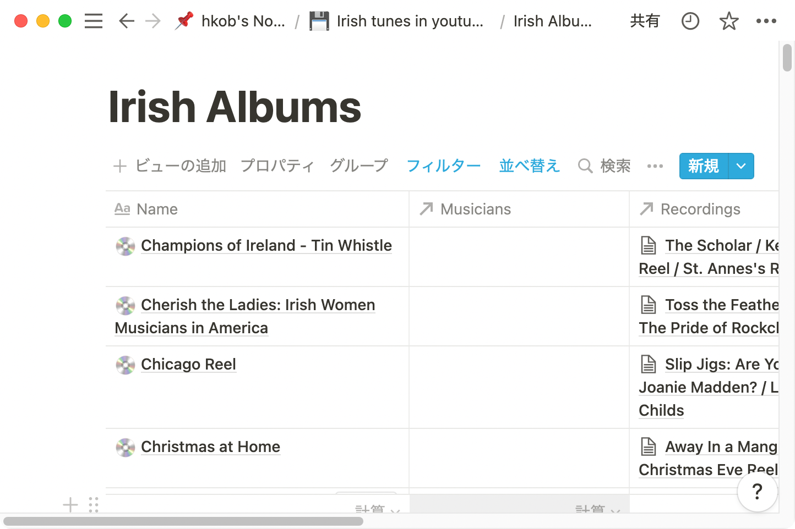

# notion_ruby_mapping

Notion Ruby mapping is currently under development.

Development note is here. → [Idea note of "notion_ruby_mapping"](https://www.notion.so/hkob/Idea-note-of-notion_ruby_mapping-3b0a3bb3c171438a830f9579d41df501)

## Table of Contents


<!-- @import "[TOC]" {cmd="toc" depthFrom=1 depthTo=6 orderedList=false} -->

<!-- code_chunk_output -->

- [notion\_ruby\_mapping](#notion_ruby_mapping)
  - [Table of Contents](#table-of-contents)
  - [1. Installation](#1-installation)
  - [2. Example code](#2-example-code)
    - [2.1 Set icon to all icon unsettled pages](#21-set-icon-to-all-icon-unsettled-pages)
    - [2.2 Renumbering pages](#22-renumbering-pages)
    - [2.3 Change title](#23-change-title)
      - [Pattern 1 (replace existing text partially)](#pattern-1-replace-existing-text-partially)
      - [Pattern 2 (replace all text)](#pattern-2-replace-all-text)
  - [3. Preparation](#3-preparation)
    - [3.1 Create a New Integration](#31-create-a-new-integration)
    - [3.2 Create client](#32-create-client)
  - [4. Usage](#4-usage)
    - [4.1 Page](#41-page)
      - [4.1.1 Retrieve a page](#411-retrieve-a-page)
      - [4.1.2 Update page properties](#412-update-page-properties)
      - [4.1.3 Update other page information](#413-update-other-page-information)
      - [4.1.4 other methods](#414-other-methods)
    - [4.2 Page](#42-page)
      - [4.2.1 Retrieve a database](#421-retrieve-a-database)
      - [4.2.2 Query a database](#422-query-a-database)
        - [4.2.2.1 Complex conditions](#4221-complex-conditions)
        - [4.2.2.2 Sort criteria](#4222-sort-criteria)
      - [4.2.3 Update database](#423-update-database)
    - [4.3 List class](#43-list-class)
    - [4.4 Block class](#44-block-class)
    - [4.5 Property classes](#45-property-classes)
      - [4.5.1 How to obtain Property object](#451-how-to-obtain-property-object)
      - [4.5.2 Query object generator of property objects](#452-query-object-generator-of-property-objects)
      - [4.5.3 create or update values for Page properties](#453-create-or-update-values-for-page-properties)
        - [4.5.3.1 NumberProperty](#4531-numberproperty)
        - [4.5.3.2 SelectProperty](#4532-selectproperty)
        - [4.5.3.3 MultiSelectProperty](#4533-multiselectproperty)
        - [4.5.3.4 DateProperty](#4534-dateproperty)
        - [4.5.3.4 UrlProperty](#4534-urlproperty)
        - [4.5.3.5 EmailProperty](#4535-emailproperty)
        - [4.5.3.6 PhoneNumberProperty](#4536-phonenumberproperty)
        - [4.5.3.7 PeopleProperty](#4537-peopleproperty)
        - [4.5.3.8 TitleProperty, RichTextProperty](#4538-titleproperty-richtextproperty)
        - [4.5.3.9 CheckboxProperty](#4539-checkboxproperty)
        - [4.5.3.10 EmailProperty](#45310-emailproperty)
        - [4.5.3.11 FilesProperty](#45311-filesproperty)
        - [4.5.3.12 RelationProperty](#45312-relationproperty)
  - [6. ChangeLog](#6-changelog)
  - [6. Contributing](#6-contributing)
  - [7. License](#7-license)
  - [8. Code of Conduct](#8-code-of-conduct)
  - [9. Acknowledgements](#9-acknowledgements)

<!-- /code_chunk_output -->


## 1. Installation

Add this line to your application's Gemfile:

```ruby
gem 'notion_ruby_mapping'
```

And then execute:

```shell
bundle install
```

Or install it yourself as:

```shell
gem install notion_ruby_mapping
```

## 2. Example code

### 2.1 Set icon to all icon unsettled pages

The following code sets a "💿" icon on all unset pages in the database.

```Ruby
require "notion_ruby_mapping"

include NotionRubyMapping

token = ENV["NOTION_API_TOKEN"]
database_id = ENV["DATABASE_ID"]

NotionCache.instance.create_client token

db = Database.new id: database_id
db.query_database.each do |page|
  p page.set_icon(emoji: "💿").id unless page.icon
end
```

|Before execution|After execution|
|---|---|
|||

### 2.2 Renumbering pages

The following code sets serial numbers to the pages whose title is not empty in ascending order of titles.

```Ruby
db = Database.new id: database_id, assign: [RichTextProperty, "TextTitle"]
tp = db.properties["TextTitle"]
query = tp.filter_is_not_empty.ascending(tp)
db.query_database(tp.filter_is_not_empty.ascending(tp)).each.with_index(1) do |page, index|
  page.properties["NumberTitle"].number = index
  page.update
end
```

| After execution                               |
|-----------------------------------------------|
|  |

### 2.3 Change title

The following code update the page title.

#### Pattern 1 (replace existing text partially)

```Ruby
page = Page.find page_id # API access
print page.title # -> ABC\nDEF
tp = page.properties["Title"]
tp[1].text = "GHI"
page.update # API access
print page.title # -> ABC\nGHI
```

#### Pattern 2 (replace all text)

```Ruby
page = Page.new id: page_id, assign: [TitleProperty, "Title"]
tp = page.properties["Title"]
tp << TextObject.new("JKL")
page.update # API access
print page.title # -> JKL
```

## 3. Preparation

### 3.1 Create a New Integration

Please check [Notion documentation](https://developers.notion.com/docs#getting-started).

### 3.2 Create client

Please create a client (notion-ruby-client) before you use the following class.

```Ruby
NotionCache.instance.create_client ENV["NOTION_API_TOKEN"]
```

## 4. Usage

### 4.1 Page

#### 4.1.1 Retrieve a page

`Page.find(id)` creates a Page object with `retrieving page API`.
The created object has page information generated from the JSON response.

```Ruby
page = Page.find "c01166c6-13ae-45cb-b968-18b4ef2f5a77" # Notion API call
```

`Page.new(id)` creates a Page object without the Notion API.
Since Page.new does not acquire property information, so you need to assign yourself.

```Ruby
# Assign some properties for update manually
# The argument of assign keyword is Array with the multiple pairs of PropertyClass and Property name
page = Page.new id: "c01166c6-13ae-45cb-b968-18b4ef2f5a77",
                assign: [TitleProperty, "Title", NumberProperty, "NumberTitle"]
```

#### 4.1.2 Update page properties

Page properties with values can be obtained from the retrieved page using `find`.
On the other hand, Page properties without values can be obtained from the property assigned page.

```Ruby
tp = page.properties["Title"] # TitleProperty
np = page.properties["Number"] # NumberProperty
```

Each property object can change values using corresponded methods.
After changing value, `will_update` flag of the property object also set to true.
These methods are explained in the section of each property object class.

```Ruby
to = tp[1] # TitleProperty has Array of TextObject
to.text = "ABC" # TextObject can set text by ".text="
# or tp[1].text = "ABC"

np.number = 3.14159
```

After update some properties, `page.update` method sends `update page API` and replace the page information using the response of API.

```Ruby
page.update # Notion API call
```

#### 4.1.3 Update other page information

`page.set_icon` can change the page icon using emoji or external url.

```Ruby
# both methods call Notion API
obj.set_icon emoji: "💿" # set emoji
obj.set_icon url: "https://cdn.profile-image.st-hatena.com/users/hkob/profile.png" # set external url
```

#### 4.1.4 other methods

- `page.title` returns plain_text string of `Title`.
- `page.icon` returns JSON hash for the page icon.
- `page[key]` returns a hash or an array object except "properties".

### 4.2 Page

#### 4.2.1 Retrieve a database

`Database.find(id)` creates a Database object with `retrieving database API`.
The created object has database information generated from the JSON response.

```Ruby
db = Database.find("c37a2c66-e3aa-4a0d-a447-73de3b80c253") # Notion API call
```

`Database.new(id)` creates a Database object without the Notion API.
Since Database.new does not acquire property information, so you need to assign yourself.

```Ruby
# assign some properties for update manually
db = Database.new id: "c37a2c66-e3aa-4a0d-a447-73de3b80c253",
                assign: [TitleProperty, "Title", NumberProperty, "NumberTitle"]
```

#### 4.2.2 Query a database

`db.query_database` obtains a List object with Page objects contained in the database.
You can obtain filtered and ordered pages using Query object.

```Ruby
# query_database method calls Notion API
db.query_database # retrieves all pages (no filter, no sort)
db.query_database query # retrieves using query
```

The query object can be generated from the Property objects included in the database object.
The Property object can be obtained from the retrieved or assigned database object like as the Page object.

`filter_xxxx` methods of the property objects generates a query object.
These methods are explained in the section of each property object class.

```Ruby
tp = db.properties["Title"]
query = tp.filter_starts_with("A").ascending(tp)
pages = db.query_database query
```

##### 4.2.2.1 Complex conditions

Complex filters can be generated `and` / `or` methods of the Query object.
Here are some sample scripts and the json parameters created from them.

```Ruby
# Prepare some sample properties
db = Database.new id: "sample database id",
                  assign: [
                    TitleProperty, "tp",
                    NumberProperty, "np",
                    CheckboxProperty, "cp",
                    LastEditedTimeProperty, "letp",
                  ]
properties = db.properties # PropertyCache object
# PropertyCache object can receive [] or values_at methods.
# `values_at` method is useful when retrieving multiple properties at once.
(tp, np, cp, letp) = properties.values_at "tp", "np", "cp", "letp"
```

- query1: (A and B) filter

```Ruby
query1 = tp.filter_starts_with("start")
           .and(np.filter_greater_than(100))

# Result of query1.filter
{
  "and" => [
    {
      "property" => "tp",
      "title" => {"starts_with" => "start"},
    },
    {
      "property" => "np",
      "number" => {"greater_than" => 100},
    },
  ],
}
```

- query2: (A and B and C) filter

```Ruby
query2 = tp.filter_starts_with("start")
  .and(np.filter_greater_than(100))
  .and(cp.filter_equals(true))

# Result of query2.filter
{
  "and" => [
    {
      "property" => "tp",
      "title" => {"starts_with" => "start"},
    },
    {
      "property" => "np",
      "number" => {"greater_than" => 100},
    },
    {
      "property" => "cp",
      "checkbox" => {"equals" => true},
    },
  ],
}
```

- query3: (A or B) filter

```Ruby
query3 = tp.filter_starts_with("start")
  .or(np.filter_greater_than(100))

# Result of query3.filter
{
  "or" => [
    {
      "property" => "tp",
      "title" => {"starts_with" => "start"},
    },
    {
      "property" => "np",
      "number" => {"greater_than" => 100},
    },
  ],
}
```

- query4: (A or B or C) filter

```Ruby
query4 = tp.filter_starts_with("start")
      .or(np.filter_greater_than(100))
      .or(cp.filter_equals(true))

# Result of query4.filter
{
  "or" => [
    {
      "property" => "tp",
      "title" => {"starts_with" => "start"},
    },
    {
      "property" => "np",
      "number" => {"greater_than" => 100},
    },
    {
      "property" => "cp",
      "checkbox" => {"equals" => true},
    },
  ],
}
```

- query5: ((A and B) or C) filter

```Ruby
query5 = tp.filter_starts_with("start")
  .and(np.filter_greater_than(100))
  .or(cp.filter_equals(true))

# Result of query5.filter
{
  "or" => [
    {
      "and" => [
        {
          "property" => "tp",
          "title" => {"starts_with" => "start"},
        },
        {
          "property" => "np",
          "number" => {"greater_than" => 100},
        },
      ],
    },
    {
      "property" => "cp",
      "checkbox" => {"equals" => true},
    },
  ],
}
```

- query6: ((A or B) and C) filter

```Ruby
query6 = tp.filter_starts_with("start")
  .or(np.filter_greater_than(100))
  .and(cp.filter_equals(true))

# Result of query6.filter
{
  "and" => [
    {
      "or" => [
        {
          "property" => "tp",
          "title" => {"starts_with" => "start"},
        },
        {
          "property" => "np",
          "number" => {"greater_than" => 100},
        },
      ],
    },
    {
      "property" => "cp",
      "checkbox" => {"equals" => true},
    },
  ],
}
```

- query7: ((A and B) or (C and D)) filter

```Ruby
query7 = np.filter_greater_than(100).and(np.filter_less_than(200))
      .or(np.filter_greater_than(300).and(np.filter_less_than(400)))

# Result of query7.filter
{
  "or" => [
    {
      "and" => [
        {
          "property" => "np",
          "number" => {"greater_than" => 100},
        },
        {
          "property" => "np",
          "number" => {"less_than" => 200},
        },
      ],
    },
    {
      "and" => [
        {
          "property" => "np",
          "number" => {"greater_than" => 300},
        },
        {
          "property" => "np",
          "number" => {"less_than" => 400},
        },
      ],
    },
  ],
}
```

##### 4.2.2.2 Sort criteria

Sort criteria can be appended to an existing query object.
If you don't use the previous filters, you can generate by `Query.new`.

- sort criteria only

```Ruby
query8 = Query.new.ascending tp
query9 = Query.new.ascending letp
query10 = Query.new.descending tp
query11 = Query.new.descending letp
query12 = Query.new.ascending(tp).descending letp

# Result of query8.sort
[{"property" => "tp", "direction" => "ascending"}]

# Result of query9.sort
[{"timestamp" => "letp", "direction" => "ascending"}]

# Result of query10.sort
[{"property" => "tp", "direction" => "descending"}]

# Result of query11.sort
[{"timestamp" => "letp", "direction" => "descending"}]

# Result of query12.sort
[
  {"property" => "tp", "direction" => "ascending"},
  {"timestamp" => "letp", "direction" => "descending"},
]
```

- filter with sort

```Ruby
query13 = tp.filter_starts_with("A").ascending(tp)

# Result of query13.filter
{"property" => "tp", "title" => {"starts_with" => "start"}}

# Result of query13.sort
[{"property" => "tp", "direction" => "ascending"}]
```

#### 4.2.3 Update database

=== under construction ===

### 4.3 List class

`db.query_database` and other API list results returns a List object.
The list object is an Enumerable object, so usually combines with `.each` method.

```Ruby
db.query_database(query).each do |page|
  # exec some methods for a page object
end
```

Notion API returns only the first page-size objects.
The default page-size of this library is 100.
Since the above `.each` method is supported for paging, it will automatically execute API call that obtain the following 100 objects when you used the first 100 objects.
Users do not have to worry about paging.

### 4.4 Block class

=== under construction ===

### 4.5 Property classes

#### 4.5.1 How to obtain Property object

There are the following 17 XXXProperty classes corresponding to Notion databases.

1. TitleProperty
2. RichTextProperty
3. UrlProperty
4. EmailProperty
5. PhoneNumberProperty
6. NumberProperty
7. CheckboxProperty
8. SelectProperty
9. MultiSelectProperty
10. PeopleProperty
11. CreatedByProperty
12. LastEditedByProperty
13. DateProperty
14. CreatedTimeProperty
15. LastEditedTimeProperty
16. FilesProperty
17. FormulaProperty

They are child classes of a `Property` class and generated from Page or Database objects.

```Ruby
page = Page.new page_id, assign: [XXXProperty, "property_name"]
# or
page = Page.find page_id

xp = page.properties["property_name"]
# or
xp, yp = page.properties.values_at "xp_name", "yp_name"
```

#### 4.5.2 Query object generator of property objects

The following methods for the Property objects generate a query object.

- TitleProperty, RichTextProperty, UrlProperty, EmailProperty, PhoneNumberProperty
  - filter_equals(value)
  - filter_does_not_equal(value)
  - filter_contains(value)
  - filter_does_not_contain(value)
  - filter_starts_with(value)
  - filter_ends_with(value)
  - filter_is_empty
  - filter_is_not_empty
- NumberProperty
  - filter_equals(value)
  - filter_does_not_equal(value)
  - filter_greater_than(value)
  - filter_less_than(value)
  - filter_greater_than_or_equal_to(value)
  - filter_less_than_or_equal_to(value)
  - filter_is_empty
  - filter_is_not_empty
- CheckboxProperty
  - filter_equals(value)
  - filter_does_not_equal(value)
- SelectProperty
  - filter_equals(value)
  - filter_does_not_equal(value)
  - filter_is_empty
  - filter_is_not_empty
- MultiSelectProperty, PeopleProperty, CreatedByProperty, LastEditedByProperty
  - filter_contains(value)
  - filter_does_not_contain(value)
  - filter_is_empty
  - filter_is_not_empty
- DateProperty, CreatedTimeProperty, LastEditedTimeProperty
  - filter_equals(value(Date / Time / DateTime / String))
  - filter_does_not_equal(value(Date / Time / DateTime / String))
  - filter_before(value(Date / Time / DateTime / String))
  - filter_after(value(Date / Time / DateTime / String))
  - filter_on_or_before(value(Date / Time / DateTime / String))
  - filter_on_or_after(value(Date / Time / DateTime / String))
  - filter_past_week
  - filter_past_month
  - filter_past_year
  - filter_next_week
  - filter_next_month
  - filter_next_year
- FilesProperty
  - filter_is_empty
  - filter_is_not_empty
- FormulaProperty
  - filter_equals(value(Date / Time / DateTime / String))
  - filter_does_not_equal(value(Date / Time / DateTime / String))
  - filter_before(value(Date / Time / DateTime / String))
  - filter_after(value(Date / Time / DateTime / String))
  - filter_on_or_before(value(Date / Time / DateTime / String))
  - filter_on_or_after(value(Date / Time / DateTime / String))
  - filter_past_week
  - filter_past_month
  - filter_past_year
  - filter_next_week
  - filter_next_month
  - filter_next_year
  - filter_contains(value)
  - filter_does_not_contain(value)
  - filter_starts_with(value)
  - filter_ends_with(value)
  - filter_greater_than(value)
  - filter_less_than(value)
  - filter_greater_than_or_equal_to(value)
  - filter_less_than_or_equal_to(value)
  - filter_is_empty
  - filter_is_not_empty

#### 4.5.3 create or update values for Page properties

Retrieving Page object has XXXProperties with values.
On the other hand, Assigned Page object has also XXXProperties, but they don't have any information for pages.

XXXProperties can change property values by setter methods.
Since the setter method is different for each class, it will be explained separately.

##### 4.5.3.1 NumberProperty

NumberProperty can set a number by `.number=`.

```Ruby
np = page.properties["NumberTitle"]
np.number = 3.14
p np.property_values_json
# Result => => {"np"=>{"number"=>3.14, "type"=>"number"}}
```

##### 4.5.3.2 SelectProperty

NumberProperty can set a select name by `.select=`.

```Ruby
sp = page.properties["SelectTitle"]
sp.select = "Select 2"
p sp.property_values_json
# Result => {"sp"=>{"type"=>"select", "select"=>{"name"=>"Select 2"}}}
```

##### 4.5.3.3 MultiSelectProperty

MultiSelectProperty can set a select value or Array of select values by `.multi_select=`.

```Ruby
msp = page.properties["MultiSelectTitle"]
msp.multi_select = "MS2"
p msp.property_values_json
# Result => {"msp"=>{"type"=>"multi_select", "multi_select"=>[{"name"=>"MS2"}]}}

msp.multi_select = %w[MS2 MS1]
p msp.property_values_json
# Result => {"msp"=>{"type"=>"multi_select", "multi_select"=>[{"name"=>"MS2"}, {"name"=>"MS1"}]}}
```

##### 4.5.3.4 DateProperty

DateProperty can set a start_date or end_date by `.start_date=` or `end_date=`.
Date, Time, DateTime or String object can be used to the argument.

```Ruby
dp = page.properties["DateTitle"]
dp.start_date = Date.new(2022, 2, 22)
p dp.property_values_json
# Result => {"dp"=>{"type"=>"date", "date"=>{"start"=>"2022-02-22", "end"=>nil, "time_zone"=>nil}}}

dp.start_date = Time.new(2022, 2, 22, 1, 23, 45, "+09:00")
p dp.property_values_json
# Result =>{"dp"=>{"type"=>"date", "date"=>{"start"=>"2022-02-22T01:23:45+09:00", "end"=>nil, "time_zone"=>nil}}}

dp.start_date = DateTime.new(2022, 2, 23, 1, 23, 45, "+09:00")
p dp.property_values_json
# Result => {"dp"=>{"type"=>"date", "date"=>{"start"=>"2022-02-23T01:23:45+09:00", "end"=>nil, "time_zone"=>nil}}}

dp.start_date = Date.new(2022, 2, 20)
dp.end_date = Date.new(2022, 2, 22)
p dp.property_values_json
# Result => => {"dp"=>{"type"=>"date", "date"=>{"start"=>"2022-02-20", "end"=>"2022-02-22", "time_zone"=>nil}}}

dp.start_date = Time.new(2022, 2, 21, 1, 23, 45, "+09:00")
dp.end_date = Time.new(2022, 2, 22, 1, 23, 45, "+09:00")
p dp.property_values_json
# Result => {"start" => "2022-02-21T01:23:45+09:00", "end" => "2022-02-22T01:23:45+09:00"}

dp.start_date = DateTime.new(2022, 2, 21, 1, 23, 45, "+09:00")
dp.end_date = DateTime.new(2022, 2, 22, 1, 23, 45, "+09:00")
p dp.property_values_json
# result => {"dp"=>{"type"=>"date", "date"=>{"start"=>"2022-02-21T01:23:45+09:00", "end"=>nil, "time_zone"=>nil}}}
```

##### 4.5.3.4 UrlProperty

UrlProperty can set a url by `.url=`.

```Ruby
up = page.properties["UrlTitle"]
up.url = "https://www.google.com/"
p up.property_values_json
# result => {"up"=>{"url"=>"https://www.google.com/", "type"=>"url"}}
```

##### 4.5.3.5 EmailProperty

EmailProperty can set an email by `.email=`.

```Ruby
ep = page.properties["MailTitle"]
ep.email = "https://www.google.com/"
p ep.property_values_json
# result => {"ep"=>{"email"=>"hkobhkob@gmail.com", "type"=>"email"}}
```

##### 4.5.3.6 PhoneNumberProperty

PhoneNumberProperty can set an phone number by `.phone_number=`.

```Ruby
pp = page.properties["TelTitle"]
pp.phone_number = "xx-xxxx-xxxx"
p pp.property_values_json
# result => {"pp"=>{"phone_number"=>"xx-xxxx-xxxx", "type"=>"phone_number"}}
```

##### 4.5.3.7 PeopleProperty

PeopleProperty can set an people by `.people=`.
PeopleProperty can set a user_id/UserObject value or Array of user_id/UserObject values by `.people=`.

```Ruby
pp = page.properties["UserTitle"]
pp.people = "user_id1"
p pp.property_values_json
# result => {"pp"=>{"type"=>"people", "people"=>[{"object"=>"user", "id"=>"user_id1"}]}}

pp.people = UserObject.new json: user1_json
p pp.property_values_json
# result => {"pp"=>{"type"=>"people", "people"=>[{"object"=>"user", "id"=>"user_id1_from_json"}]}}
```

```Ruby
pp.people = %w[user_id2 user_id3]
p pp.property_values_json
# result => {"pp"=>{"type"=>"people", "people"=>[{"object"=>"user", "id"=>"user_id2"}, {"object"=>"user", "id"=>"user_id3"}]}}

u2 = UserObject.new(json: user2_json)
u3 = UserObject.new(json: user3_json)
pp.people = [u2, u3]
p pp.property_values_json
# result => {"pp"=>{"type"=>"people", "people"=>[{"object"=>"user", "id"=>"user_id2_from_json"}, {"object"=>"user", "id"=>"user_id3_from_json"}]}}
```

##### 4.5.3.8 TitleProperty, RichTextProperty

TextProperty's subclasses (TitleProperty, RichTextProperty) have an array of TextObject objects.
`[]` method returns an existing TextObject.
The obtained TextObject can be set text by `.text=`.

```Ruby
pp = page.properties["Title"]
tp[0].text = "ABC\n"
p tp.property_values_json
# result => {"tp"=>{"type"=>"title", "title"=>[{"type"=>"text", "text"=>{"content"=>"ABC\n", "link"=>nil}, "plain_text"=>"ABC\n", "href"=>nil}]}}
```

`<<` method appends a new TextObject or a String.
```Ruby
to = TextObject.new "DEF"
to.bold = true
to.italic = true
to.strikethrough = true
to.underline = true
to.code = true
to.color = "default"
tp << to
p tp.property_values_json
# result => {"tp"=>{"type"=>"title","title"=>[{"type"=>"text","text"=>{"content"=>"ABC\n","link"=>nil},"plain_text"=>"ABC\n","href"=>nil},{"type"=>"text","text"=>{"content"=>"DEF","link"=>nil},"plain_text"=>"DEF","href"=>nil,"annotations"=>{"bold"=>true,"italic"=>true,"strikethrough"=>true,"underline"=>true,"code"=>true,"color"=>"default"}}]}}
```

`delete_at(index)` method remove a TextObject at index.
```Ruby
tp.delete_at 1
tp << "GHI"
p tp.property_values_json
# result => {"tp"=>{"type"=>"title", "title"=>[{"type"=>"text", "text"=>{"content"=>"ABC\n", "link"=>nil}, "plain_text"=>"ABC\n", "href"=>nil}, {"type"=>"text", "text"=>{"content"=>"DEF", "link"=>nil}, "plain_text"=>"DEF", "href"=>nil, "annotations"=>{"bold"=>true, "italic"=>true, "strikethrough"=>true, "underline"=>true, "code"=>true, "color"=>"default"}}, {"type"=>"text", "text"=>{"content"=>"GHI", "link"=>nil}, "plain_text"=>"GHI", "href"=>nil}]}}
```

##### 4.5.3.9 CheckboxProperty

PeopleProperty can set a boolean value by `.checkbox=`.
```Ruby
cp = page.properties["CheckboxTitle"]
cp.checkbox = true
p cp.property_values_json
# result => {"cp"=>{"checkbox"=>true, "type"=>"checkbox"}}
```

##### 4.5.3.10 EmailProperty

EmailProperty can set an email address by `.email=`.
```Ruby
ep = page.properties["MailTitle"]
ep.email = "hkobhkob@gmail.com"
p ep.property_values_json
# result => {"ep"=>{"email"=>"hkobhkob@gmail.com", "type"=>"email"}}
```

##### 4.5.3.11 FilesProperty

FilesProperty can set an external url or Array of external urls by `.files=`.

```Ruby
fp = page.properties["FilesTitle"]
fp.files = "F1"
p fp.property_values_json
# Result => {"fp"=>{"files"=>[{"name"=>"F1", "type"=>"external", "external"=>{"url"=>"F1"}}], "type"=>"files"}}

fp.files = %w[F2 F3]
p fp.property_values_json
# Result => {"fp"=>{"files"=>[{"name"=>"F2", "type"=>"external", "external"=>{"url"=>"F2"}}, {"name"=>"F3", "type"=>"external", "external"=>{"url"=>"F3"}}], "type"=>"files"}}
```

##### 4.5.3.12 RelationProperty

RelationProperty can set an relation's page_id or Array of relation's page_ids by `.relation=`.

```Ruby
rp = page.properties["RelationTitle"]
rp.relation = "R1"
p rp.property_values_json
# Result => {"rp"=>{"type"=>"relation", "relation"=>[{"id"=>"R1"}]}}

rp.relation = %w[R2 R3]
p rp.property_values_json
# Result => {"rp"=>{"type"=>"relation", "relation"=>[{"id"=>"R2"}, {"id"=>"R3"}]}}
```


## 6. ChangeLog

- 2022/3/14 Exclude notion-ruby-client, update Property values, update for Notion-Version 2022-02-22
- 2022/2/25 add_property_for_update -> assign_property, update README.md
- 2022/2/20 add support for MultiSelectProperty
- 2022/2/19 add support for SelectProperty
- 2022/2/17 added Page#properties, Page#add_property_for_update, Page#update
- 2022/2/17 added Page#properties, Page#add_property_for_update, Page#update
- 2022/2/16 added PropertyCache and Payload class
- 2022/2/14 added Database#set_icon
- 2022/2/13 added Page#set_icon
- 2022/2/13 First commit

## 6. Contributing

Bug reports and pull requests are welcome on GitHub at <https://github.com/hkob/notion_ruby_mapping>. This project is intended to be a safe, welcoming space for collaboration, and contributors are expected to adhere to the [code of conduct](https://github.com/[USERNAME]/notion_ruby_mapping/blob/main/CODE_OF_CONDUCT.md).

## 7. License

The gem is available as open source under the terms of the [MIT License](https://opensource.org/licenses/MIT).

## 8. Code of Conduct

Everyone interacting in the NotionRubyMapping project's codebases, issue trackers, chat rooms and mailing lists is expected to follow the [code of conduct](https://github.com/[USERNAME]/notion_ruby_mapping/blob/main/CODE_OF_CONDUCT.md).

## 9. Acknowledgements

The code depends on [notion-ruby-client](https://github.com/orbit-love/notion-ruby-client).
