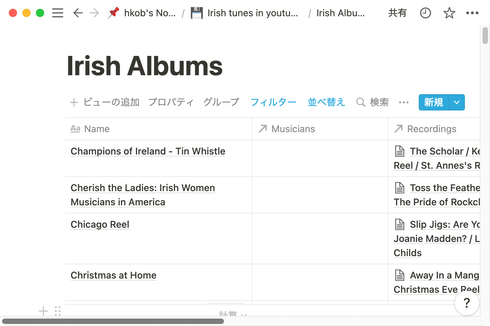
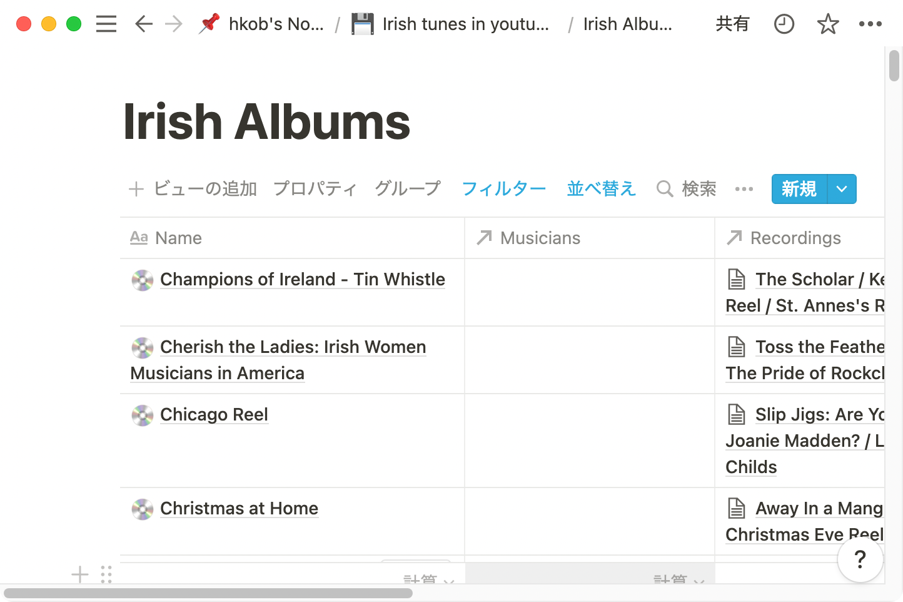

# Set icon to all icon unsettled pages

The following code sets a "💿" icon on all unset pages in the database.

```Ruby
require "notion_ruby_mapping"

include NotionRubyMapping

token = ENV["NOTION_API_TOKEN"]
database_id = ENV["DATABASE_ID"]

NotionCache.instance.create_client token

db = Database.new id: database_id
db.query_database.each do |page|
  unless page.icon
    page.set_icon(emoji: "💿")
    page.save
    p page.id
  end
end
```

|Before execution|After execution|
|---|---|
|||

---
[Return to README.md](../README.md#2-example-code)
